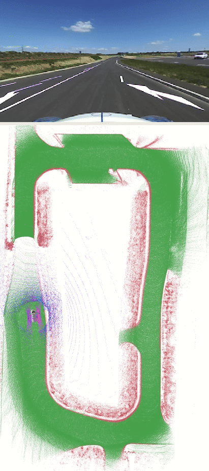
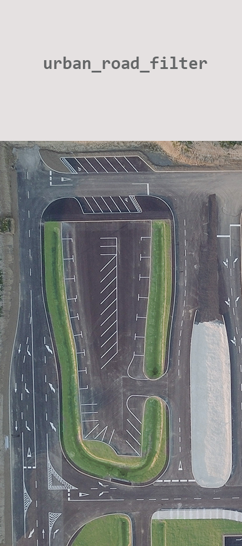
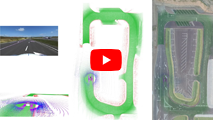
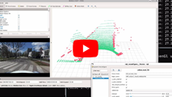
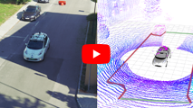
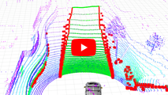
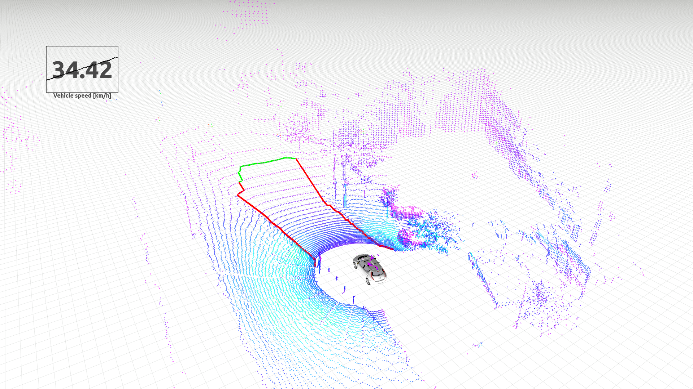
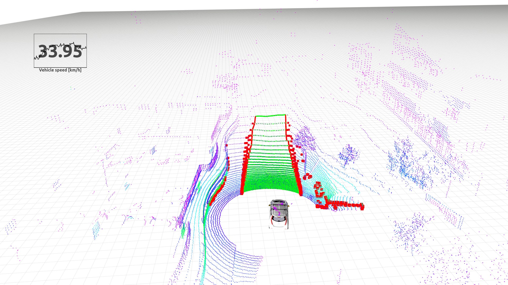
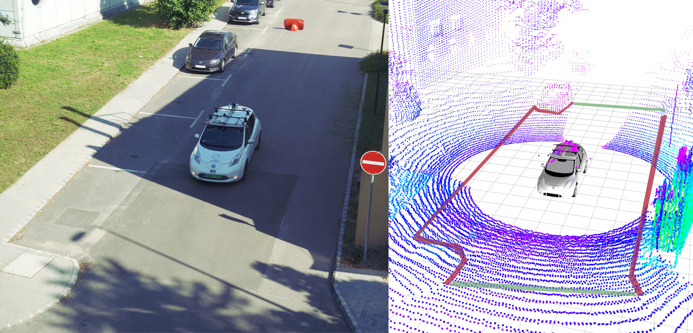
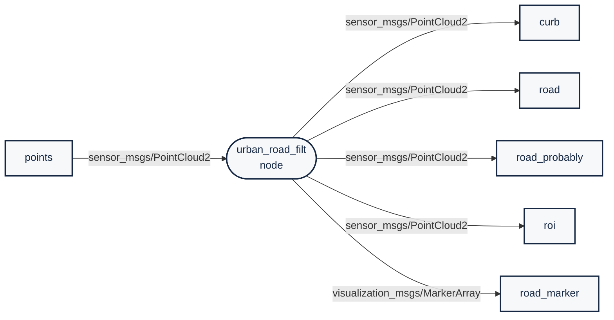

# `urban_road_filter`: a real-time LIDAR-based urban road and sidewalk detection algorithm for autonomous vehicles

 

# Dependency

- [ROS](http://wiki.ros.org/ROS/Installation) (tested with Kinetic and Melodic)
- [PCL](https://pointclouds.org/)

# Install

Use the following commands to download and compile the package.

```
cd ~/catkin_ws/src
git clone https://github.com/jkk-research/urban_road_filter
catkin build urban_road_filter
```

# Getting started

Issue the following commands to start roscore, download and play sample data, and start the algorithm with visualization. You can also watch this as a [youtube tutorial](https://www.youtube.com/watch?v=HHnj4VcbSy4).

In a **new terminal** start roscore:

```
roscore
```

In a **new terminal** go to your bag folder (e.g. `~/Downloads`):

```
cd ~/Downloads
```

Download a sample rosbag (~3,3 GB):

```r
wget https://laesze-my.sharepoint.com/:u:/g/personal/herno_o365_sze_hu/EYl_ahy5pgBBhNHt5ZkiBikBoy_j_x95E96rDtTsxueB_A?download=1 -O leaf-2021-04-23-campus.bag
```

Play rosbag:

```r
rosbag play -l ~/Downloads/leaf-2021-04-23-campus.bag
```

In a **new terminal** start the `urban_road_filter` node, `rviz` and `rqt_reconfigure` with roslaunch:

```
roslaunch urban_road_filter demo1.launch
```

# Cite & paper

If you use any of this code please consider citing the [paper](https://www.mdpi.com/1424-8220/22/1/194):

```bibtex
@Article{roadfilt2022horv,
    title = {Real-Time LIDAR-Based Urban Road and Sidewalk Detection for Autonomous Vehicles},
    author = {Horváth, Ernő and Pozna, Claudiu and Unger, Miklós},
    journal = {Sensors},
    volume = {22},
    year = {2022},
    number = {1},
    url = {https://www.mdpi.com/1424-8220/22/1/194},
    issn = {1424-8220},
    doi = {10.3390/s22010194}
}
```

# Related solutions

- [`points_preprocessor`](https://github.com/Autoware-AI/core_perception/tree/master/points_preprocessor) `ray_ground_filter` and `ring_ground_filter` (ROS)
- [`linefit_ground_segmentation`](https://github.com/lorenwel/linefit_ground_segmentation) (ROS)
- [`curb_detection`](https://github.com/linyliny/curb_detection) (ROS)
- [`3DLidar_curb_detection`](https://github.com/SohaibAl-emara/3D_Lidar_Curb_Detection) (ROS)
- [`lidar_filter`](https://github.com/ZoltanTozser/lidar_filter)
- Many more algorithms without code mentioned in the [paper](https://doi.org/10.3390/s22010194).

# Videos and images

[](https://www.youtube.com/watch?v=T2qi4pldR-E)
[](https://www.youtube.com/watch?v=HHnj4VcbSy4)

[](https://www.youtube.com/watch?v=9tdzo2AyaHM)
[](https://www.youtube.com/watch?v=lp6q_QvWA-Y)





# ROS publications / subscriptions


