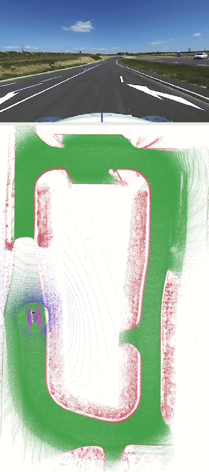
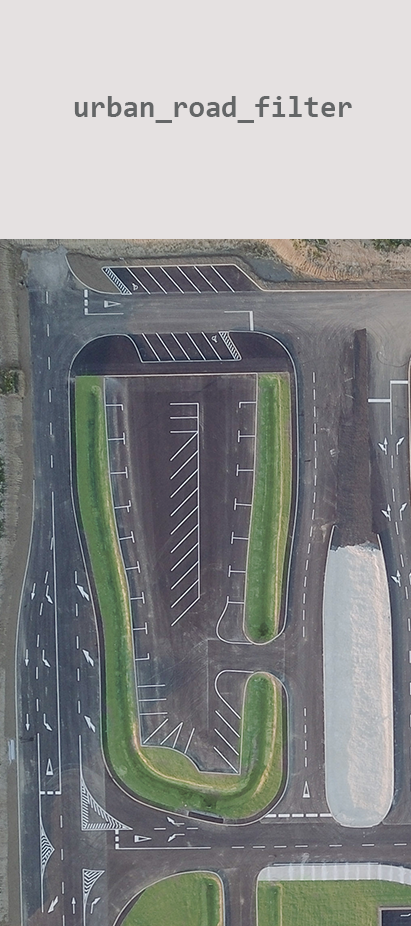
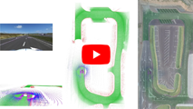
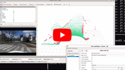
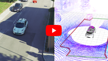
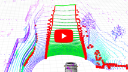
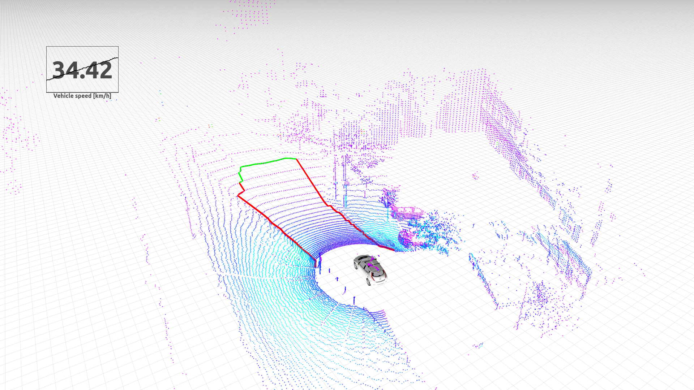
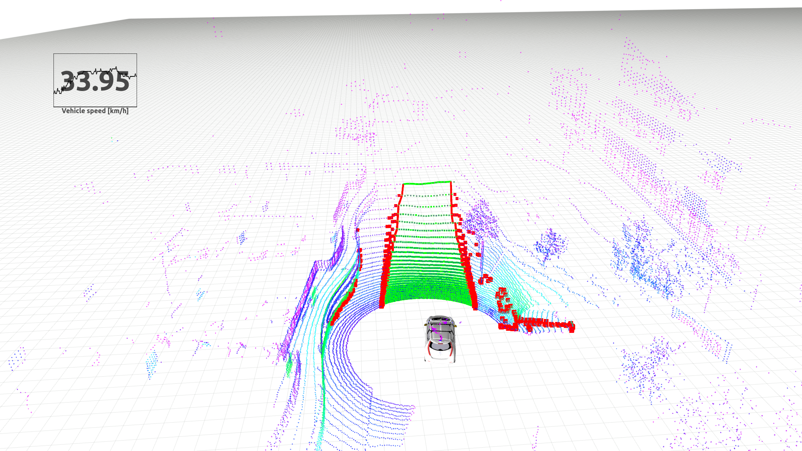
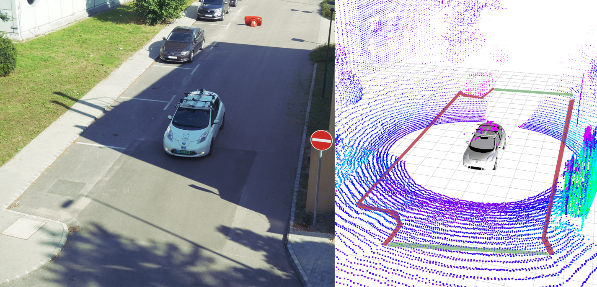
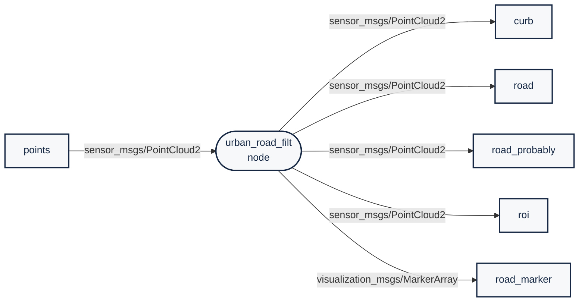

# `urban_road_filter`: a real-time LIDAR-based urban road and sidewalk detection algorithm for autonomous vehicles

 

# Dependency

- [ROS 2](https://docs.ros.org/en/humble/index.html) (tested with [Humble](https://docs.ros.org/en/humble/index.html) nad [Jazzy](https://docs.ros.org/en/jazzy/index.html))
- [PCL](https://pointclouds.org/)

# Install (download and build)

Use the following commands to download and compile the package.

```bash
cd ~/ros2_ws/src
```

```bash
git clone https://github.com/jkk-research/urban_road_filter -b ros2
```

And build:

```bash
cd ~/ros2_ws
```

```bash
colcon build --packages-select urban_road_filter --symlink-install --cmake-args -DCMAKE_BUILD_TYPE=Release
```

# Getting started

Issue the following commands to start ROS 2, play sample data, and start the algorithm with visualization.

In a **new terminal** start ROS 2:

Don't forget to source your workspace first
<details>
source ~/ros2_ws/install/setup.bash
</details>


```bash
ros2 launch urban_road_filter urban_road_filter.launch.py
```

# Features

The `urban_road_filter` package provides the following features:

1. **Detection Methods**:
   - `x_zero_method`: Detects roadside points by analyzing the angle between three points while keeping the X-coordinate constant.
   - `z_zero_method`: Detects roadside points by analyzing the angle between two vectors while keeping the Z-coordinate constant.
   - `star_shaped_method`: Uses a star-shaped algorithm to detect roadside points within a sector.

2. **Configurable Parameters**:
   - Detection area dimensions (`min_x`, `max_x`, `min_y`, `max_y`, `min_z`, `max_z`).
   - LIDAR vertical resolution (`interval`).
   - Curb detection parameters (`curb_height`, `curb_points`).
   - Polygon simplification options (`polysimp_allow`, `polysimp`, `polyz`).

3. **ROS Topics**:
   - `/road`: Filtered points representing the drivable road.
   - `/curb`: Filtered points representing curbs.
   - `/roi`: Filtered points within the region of interest.
   - `/road_marker`: Visualization markers for detected roads.

4. **Performance Metrics**:
   - Publishes statistics about the segmentation results, including the number of points classified as road, curb, or non-road.

# Configuration

The behavior of the `urban_road_filter` node can be customized using the `parameters.yaml` file. Key parameters include:

- `fixed_frame`: The fixed frame for the LIDAR data.
- `topic_name`: The topic to subscribe to for point cloud data.
- `x_zero_method`, `z_zero_method`, `star_shaped_method`: Enable or disable specific detection methods.
- `interval`: Acceptable interval for the LIDAR's vertical angular resolution.
- `curb_height`, `curb_points`: Parameters for curb detection.
- `polysimp_allow`, `polysimp`, `polyz`: Parameters for polygon simplification.

# Cite & paper

If you use any of this code, please consider citing the [paper](https://www.mdpi.com/1424-8220/22/1/194):

```bibtex
@Article{roadfilt2022horv,
    title = {Real-Time LIDAR-Based Urban Road and Sidewalk Detection for Autonomous Vehicles},
    author = {Horváth, Ernő and Pozna, Claudiu and Unger, Miklós},
    journal = {Sensors},
    volume = {22},
    year = {2022},
    number = {1},
    url = {https://www.mdpi.com/1424-8220/22/1/194},
    issn = {1424-8220},
    doi = {10.3390/s22010194}
}
```

# Related solutions

- [`points_preprocessor`](https://github.com/Autoware-AI/core_perception/tree/master/points_preprocessor) `ray_ground_filter` and `ring_ground_filter` (ROS)
- [`linefit_ground_segmentation`](https://github.com/lorenwel/linefit_ground_segmentation) (ROS)
- [`curb_detection`](https://github.com/linyliny/curb_detection) (ROS)
- [`3DLidar_curb_detection`](https://github.com/SohaibAl-emara/3D_Lidar_Curb_Detection) (ROS)
- [`lidar_filter`](https://github.com/ZoltanTozser/lidar_filter)
- Many more algorithms without code mentioned in the [paper](https://doi.org/10.3390/s22010194).

# Videos and images

[](https://www.youtube.com/watch?v=T2qi4pldR-E)
[](https://www.youtube.com/watch?v=HHnj4VcbSy4)

[](https://www.youtube.com/watch?v=9tdzo2AyaHM)
[](https://www.youtube.com/watch?v=lp6q_QvWA-Y)





# ROS publications / subscriptions


```mermaid
flowchart LR

P[points]:::gray -->|sensor_msgs/PointCloud2| U([urban_road_filt</br>node]):::gray
U --> |sensor_msgs/PointCloud2| A[curb]:::gray
U --> |sensor_msgs/PointCloud2| B[road]:::gray 
U --> |sensor_msgs/PointCloud2| C[road_probably]:::gray
U --> |sensor_msgs/PointCloud2| D[roi]:::gray
U --> |visualization_msgs/MarkerArray| E[road_marker]:::gray

classDef light fill:#34aec5,stroke:#152742,stroke-width:2px,color:#152742  
classDef dark fill:#152742,stroke:#34aec5,stroke-width:2px,color:#34aec5
classDef white fill:#ffffff,stroke:#152742,stroke-width:2px,color:#152742
classDef gray fill:#f6f8fa,stroke:#152742,stroke-width:2px,color:#152742
classDef red fill:#ef4638,stroke:#152742,stroke-width:2px,color:#fff
```
